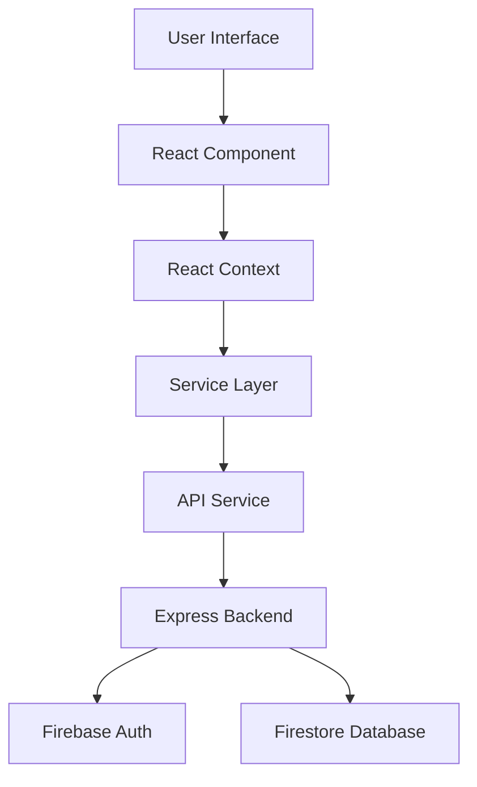

# HMCTS Task Manager

<div align="center">


[](https://reactjs.org/)
[](https://firebase.google.com/)
[](https://expressjs.com/)
[](https://nodejs.org/)
[](https://opensource.org/licenses/MIT)

*A modern task management application designed specifically for HMCTS caseworkers*

[Features](#features) • [Getting Started](#getting-started) • [Architecture](#architecture) • [Security](#security) • [API Documentation](#api-documentation) • [Contributing](#contributing)

</div>

## 📋 Overview

HMCTS Task Manager is a comprehensive task management solution built to streamline casework workflows. It enables caseworkers to efficiently create, track, and manage tasks, improving productivity and collaboration across teams.

The application features a modern React frontend, a secure Node.js/Express backend, and leverages Firebase for authentication and data storage. It implements industry-standard security practices and provides a responsive, intuitive user interface.

<details>
<summary><strong>📸 Screenshots</strong></summary>
<br>

| Landing Page | Task Dashboard | Task Details |
|:-------------------------:|:-------------------------:|:-------------------------:|
|  |  |  |

</details>

## ✨ Features

- **Comprehensive Task Management**
  - Create, update, and delete tasks
  - Assign tasks to specific users
  - Set due dates and times for task completion
  - Track task status (Pending, In Progress, Completed)
  - Full task history with activity logs

- **Advanced User Interface**
  - Intuitive dashboard with filtering and sorting options
  - Responsive design for all device sizes
  - Search functionality to quickly find tasks
  - Real-time updates for collaborative environments

- **Robust Authentication**
  - Email and password authentication
  - Google single sign-on integration
  - Multi-factor authentication support
  - Role-based authorization (User, Manager, Admin)

- **User Profiles**
  - View and edit user information
  - Track task statistics
  - Manage user roles and permissions
  - Profile picture upload support

- **Security & Compliance**
  - Content Security Policy implementation
  - HTTPS enforcement
  - CSRF protection
  - Secure authentication flows
  - GDPR-compliant data handling

## 🚀 Getting Started

### Prerequisites

- Node.js (v14.x or higher)
- npm (v6.x or higher)
- Firebase account
- Git

### Installation

1. Clone the repository:

```bash
git clone https://github.com/your-organization/hmcts-task-manager.git
cd hmcts-task-manager
```

2. Set up environment variables:

Create a `.env` file in both the client and server directories with the following variables:

<details>
<summary><strong>Client Environment Variables</strong></summary>

```
REACT_APP_FIREBASE_API_KEY=your_firebase_api_key
REACT_APP_FIREBASE_AUTH_DOMAIN=your_firebase_auth_domain
REACT_APP_FIREBASE_PROJECT_ID=your_firebase_project_id
REACT_APP_FIREBASE_STORAGE_BUCKET=your_firebase_storage_bucket
REACT_APP_FIREBASE_MESSAGING_SENDER_ID=your_firebase_messaging_sender_id
REACT_APP_FIREBASE_APP_ID=your_firebase_app_id
REACT_APP_API_URL=http://localhost:5000/api
```
</details>

<details>
<summary><strong>Server Environment Variables</strong></summary>

```
PORT=5000
NODE_ENV=development
FIREBASE_DATABASE_URL=your_firebase_database_url
```
</details>

3. Install dependencies:

```bash
# Install client dependencies
cd client
npm install

# Install server dependencies
cd ../server
npm install
```

4. Add Firebase service account:

Place your Firebase Admin SDK service account key in the `server` directory as `ministryofjustice-c0344-firebase-adminsdk-fbsvc-29d8f0a066.json`.

5. Start the development servers:

```bash
# Start the backend server
cd server
npm start

# In a separate terminal, start the client
cd client
npm start
```

6. Open [http://localhost:3000](http://localhost:3000) in your browser.

## 🏗️ Architecture

### Frontend Architecture

HMCTS Task Manager utilizes a modern React architecture with the following key components:

```
client/
├── public/          # Static files
├── src/
│   ├── components/  # Reusable UI components
│   ├── context/     # React context providers
│   ├── firebase/    # Firebase configuration
│   ├── pages/       # Page components
│   ├── services/    # API and business logic services
│   ├── styles/      # CSS styles
│   ├── config/      # Application configurations
│   ├── App.js       # Main application component
│   └── index.js     # Application entry point
```

### Backend Architecture

The backend follows a RESTful API design pattern:

```
server/
├── config/          # Configuration files
├── controllers/     # Route handlers
├── middleware/      # Express middleware
├── services/        # Business logic
├── utils/           # Utility functions
└── server.js        # Entry point
```

### Data Flow Diagram



## 🔒 Security

HMCTS Task Manager implements numerous security measures:

- **Authentication & Authorization**
  - Firebase Authentication with secure token validation
  - Role-based access control (RBAC)
  - Session management with secure token handling

- **Data Protection**
  - HTTPS enforcement
  - Input validation and sanitization
  - Parameter validation to prevent injection attacks

- **Frontend Security**
  - Content Security Policy (CSP)
  - Secure cookie settings
  - XSS protection

- **API Security**
  - Rate limiting
  - Request validation
  - CORS configuration

- **Infrastructure Security**
  - Secrets management
  - Dependency security scanning
  - Regular security updates

## 📚 API Documentation

### Authentication Endpoints

| Method | Endpoint | Description | Authentication Required |
|--------|----------|-------------|------------------------|
| POST   | `/api/login` | User login | No |
| POST   | `/api/register` | User registration | No |
| POST   | `/api/logout` | User logout | Yes |
| GET    | `/api/verify-token` | Verify authentication token | Yes |

### Task Endpoints

| Method | Endpoint | Description | Authentication Required |
|--------|----------|-------------|------------------------|
| GET    | `/api/tasks` | Get all tasks | Yes |
| GET    | `/api/tasks/:id` | Get task by ID | Yes |
| POST   | `/api/tasks` | Create a new task | Yes |
| PUT    | `/api/tasks/:id` | Update a task | Yes |
| DELETE | `/api/tasks/:id` | Delete a task | Yes |
| PATCH  | `/api/tasks/:id/status` | Update task status | Yes |

### User Endpoints

| Method | Endpoint | Description | Authentication Required |
|--------|----------|-------------|------------------------|
| GET    | `/api/users` | Get all users | Yes |
| GET    | `/api/users/:id` | Get user by ID | Yes |
| PUT    | `/api/users/:id` | Update user information | Yes |
| GET    | `/api/users/:id/stats` | Get user statistics | Yes |

## 🤝 Contributing

We welcome contributions to HMCTS Task Manager! Please see our [Contributing Guide](CONTRIBUTING.md) for more information.

### Development Workflow

1. Fork the repository
2. Create a feature branch: `git checkout -b feature/amazing-feature`
3. Commit your changes: `git commit -m 'Add amazing feature'`
4. Push to the branch: `git push origin feature/amazing-feature`
5. Open a Pull Request

### Code Style

This project uses ESLint for code linting. Please run `npm run lint` before submitting a pull request.

## 📄 License

This project is licensed under the MIT License - see the [LICENSE](LICENSE) file for details.

## 📧 Contact

For any questions or support, please contact [your-email@example.com](mailto:your-email@example.com).

---

<div align="center">

Developed with ❤️ by the Ministry of Justice Digital Team

</div>
